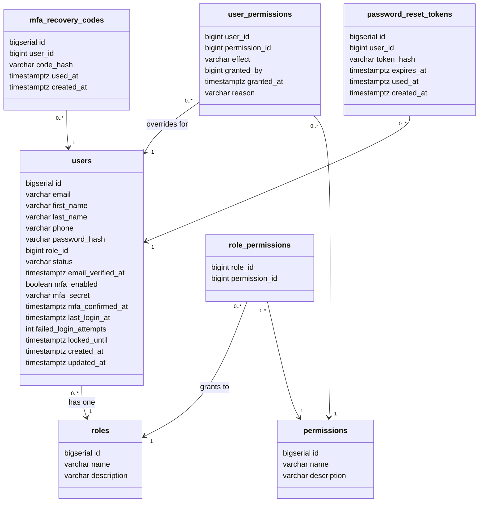

# User & Permissions Schema

The tables that answer two questions: **who is this person**, and **what are they allowed to do**.

**Design decisions baked in:**

- One role per user — a user cannot hold two roles at once
- Per-user permission exceptions on top of the role, so one person can have something their colleagues on the same role don't
- Single company — no multi-tenant `organization_id` anywhere
- Soft delete only — rows are never removed, `status` is flipped instead

---

## Class diagram

| Marker | Name | What it means |
|---|---|---|
| `PK` | Primary key | The row's identity. Unique, never changes, never reused. Other tables point at this. |
| `UK` | Unique key | No two rows may share this value — but it isn't the identity. `email` is unique, yet users are identified internally by `id`, because an email can change and an `id` never does. |
| `FK` | Foreign key | Points at a row in another table. This is what creates a link. |

### How the tables connect

Every arrow is a foreign key and points **from the many side to the one side** — read it as "belongs to". `*` means many, `1` means one.

```text
 ┌───────────┐  *      1  ┌───────────┐  1      *  ┌────────────────────┐
 │   users   │───────────►│   roles   │◄───────────│  role_permissions  │
 └─────┬─────┘            └───────────┘            └──────────┬─────────┘
       │                                                      │ *
       │ 1                                                    │
       │                                                      ▼ 1
       │      *   ┌────────────────────┐   *        ┌──────────────────┐
       ├─────────►│  user_permissions  │───────────►│   permissions    │
       │          └────────────────────┘            └──────────────────┘
       │
       │      *   ┌────────────────────────┐
       ├─────────►│   mfa_recovery_codes   │
       │          └────────────────────────┘
       │
       │      *   ┌────────────────────────┐
       └─────────►│ password_reset_tokens  │
                  └────────────────────────┘
```

Read in plain language:

- **many `users` → one `roles`** — every user has exactly one role, and many users share the same role
- **`role_permissions` sits between `roles` and `permissions`** — it's the list of which permissions each role includes. It points at both, so one role can have many permissions and one permission can belong to many roles
- **`user_permissions` sits between `users` and `permissions`** — the per-person exceptions, layered on top of whatever the role already gives
- **`mfa_recovery_codes` and `password_reset_tokens` each point at `users`** — one user owns many of them

The two tables in the middle exist because a foreign key column can only hold **one** value. To let a role have ten permissions, you need ten rows in a table between them. That's what a join table is.

### Table detail

```text
┌─ users ──────────────────────────────────────────
│  PK   id                          bigserial
│  UK   email                       varchar(255)
│       first_name                  varchar(100)
│       last_name                   varchar(100)
│       phone                       varchar(20)
│       password_hash               varchar(255)
│  FK   role_id → roles.id          bigint
│       status                      varchar(20)
│       email_verified_at           timestamptz
│       mfa_enabled                 boolean
│       mfa_secret                  varchar(255)
│       mfa_confirmed_at            timestamptz
│       last_login_at               timestamptz
│       failed_login_attempts       int
│       locked_until                timestamptz
│       created_at                  timestamptz
│       updated_at                  timestamptz
└──────────────────────────────────────────────────

┌─ roles ──────────────────────────────────────────
│  PK   id                          bigserial
│  UK   name                        varchar(50)
│       description                 varchar(255)
└──────────────────────────────────────────────────

┌─ permissions ────────────────────────────────────
│  PK   id                          bigserial
│  UK   name                        varchar(100)
│       description                 varchar(255)
└──────────────────────────────────────────────────

┌─ role_permissions ───────────────────────────────
│  PK   role_id → roles.id          bigint
│  PK   permission_id → permissions.id
└──────────────────────────────────────────────────

┌─ user_permissions ───────────────────────────────
│  PK   user_id → users.id          bigint
│  PK   permission_id → permissions.id
│       effect       GRANT | DENY   varchar(5)
│  FK   granted_by → users.id       bigint
│       granted_at                  timestamptz
│       reason                      varchar(255)
└──────────────────────────────────────────────────

┌─ mfa_recovery_codes ─────────────────────────────
│  PK   id                          bigserial
│  FK   user_id → users.id          bigint
│       code_hash                   varchar(255)
│       used_at                     timestamptz
│       created_at                  timestamptz
└──────────────────────────────────────────────────

┌─ password_reset_tokens ──────────────────────────
│  PK   id                          bigserial
│  FK   user_id → users.id          bigint
│       token_hash                  varchar(255)
│       expires_at                  timestamptz
│       used_at                     timestamptz
│       created_at                  timestamptz
└──────────────────────────────────────────────────
```

### Relationships

| Many side | | One side | Meaning |
|---|---|---|---|
| `users.role_id` | → | `roles.id` | Every user has exactly one role |
| `role_permissions.role_id` | → | `roles.id` | A role has many permissions |
| `role_permissions.permission_id` | → | `permissions.id` | A permission belongs to many roles |
| `user_permissions.user_id` | → | `users.id` | A user may have many exceptions |
| `user_permissions.permission_id` | → | `permissions.id` | Which permission the exception covers |
| `user_permissions.granted_by` | → | `users.id` | The admin who approved it |
| `mfa_recovery_codes.user_id` | → | `users.id` | A user holds ~10 recovery codes |
| `password_reset_tokens.user_id` | → | `users.id` | A user may request several resets |

<details>
<summary><strong>Same diagram in Mermaid</strong> — renders automatically on GitHub</summary>



</details>

### How permissions resolve

```
effective = (role's permissions ∪ user GRANTs) − user DENYs
```

**Deny always wins.** This is the single rule the whole permission system rests on — the moment it has exceptions, nobody will be able to explain why a given user can or can't do something.

### Why the join tables have two-column keys

`user_permissions` is keyed on `(user_id, permission_id)` **together**. That makes it physically impossible for one user to hold both a `GRANT` and a `DENY` for the same permission — the database rejects the contradiction instead of you having to check for it in code.

---

## Field reference

### Identity & access

#### `users`

One row per human. Holds who they are, how they prove it, and what state their account is in.

| Field | Type | Flags | What it's for |
|---|---|---|---|
| `id` | bigserial | PK | The permanent internal number for this person. Never changes and is never reused, which is why every other table points at this instead of storing an email that might change. |
| `first_name` | varchar(100) | | Kept separate from the surname rather than one "full name" field, so you can greet someone by first name and sort a list by last name. |
| `last_name` | varchar(100) | | See above — splitting once at the start is far easier than parsing names apart later. |
| `email` | varchar(255) | unique | The login identity. Always store it lowercased, otherwise `Jane@x.com` and `jane@x.com` become two separate accounts and logins fail for no visible reason. |
| `phone` | varchar(20) | | Optional contact number. Store in E.164 format (`+33612345678`) so it stays valid internationally. |
| `password_hash` | varchar(255) | **secret** | The BCrypt-scrambled password — one-way, so it can be compared but never read back. The real password is never stored anywhere. |
| `role_id` | bigint | FK | Points at `roles`. One role per user, and it carries their baseline permissions. |
| `status` | varchar(20) | | Where the account stands: `PENDING_VERIFICATION` → `ACTIVE` → `SUSPENDED` / `DEACTIVATED`. Login checks this. A plain true/false couldn't tell "hasn't confirmed their email yet" apart from "banned". |
| `email_verified_at` | timestamptz | | Empty until they click the confirmation link. A timestamp instead of a yes/no answers both "did they?" and "when?". |
| `mfa_enabled` | boolean | | Whether login should demand a 6-digit code from their authenticator app. |
| `mfa_secret` | varchar(255) | **secret** | The seed shared with Google Authenticator when they scan the QR. This one is *encrypted*, not hashed — you need the original value back to calculate the code you expect, so it can't be one-way like a password. |
| `mfa_confirmed_at` | timestamptz | | Proof they actually scanned the QR and a code worked. Without this, turning 2FA on at sign-up locks people out forever if they close the tab before scanning. |
| `last_login_at` | timestamptz | | Useful for support ("when were you last in?") and for spotting dormant accounts worth deactivating. |
| `failed_login_attempts` | int | | Counts wrong passwords in a row, resetting to zero on success. Without a counter, someone can guess a 6-digit 2FA code by brute force in minutes. |
| `locked_until` | timestamptz | | Once the counter trips, refuse logins until this moment passes. A temporary lock stops attackers without permanently punishing a forgetful user. |
| `created_at` | timestamptz | | When the account was made. You will want this on every table, without exception. |
| `updated_at` | timestamptz | | When the row last changed — the first thing you check when data looks wrong. |

---

### Roles & permissions

#### `roles`

The job titles in the company. Small, slow-changing list — `ADMIN`, `INSTRUCTOR`, `STUDENT`.

| Field | Type | Flags | What it's for |
|---|---|---|---|
| `id` | bigserial | PK | What `users.role_id` points at. |
| `name` | varchar(50) | unique | The machine-readable name your code checks against. Unique, so two roles can't share one name and quietly diverge. |
| `description` | varchar(255) | | Plain English, for whoever is assigning roles in an admin screen and needs to know what they're handing out. |

#### `permissions`

Every individual action the system can allow, named `RESOURCE_ACTION` so the list stays sortable as it grows.

| Field | Type | Flags | What it's for |
|---|---|---|---|
| `id` | bigserial | PK | Referenced by both join tables below. |
| `name` | varchar(100) | unique | e.g. `COURSE_CREATE`, `USER_DEACTIVATE`, `PROGRESS_VIEW_ALL`. Naming resource first keeps related permissions together alphabetically. |
| `description` | varchar(255) | | What this actually lets someone do, in a sentence. |

#### `role_permissions`

Which permissions come with which role. Change one row here and every user with that role is updated at once.

| Field | Type | Flags | What it's for |
|---|---|---|---|
| `role_id` | bigint | PK, FK | Which role. |
| `permission_id` | bigint | PK, FK | Which permission. The two columns form the key together, so the same pairing can't be inserted twice. |

#### `user_permissions`

The exceptions — one person given something (or denied something) their colleagues on the same role don't have.

| Field | Type | Flags | What it's for |
|---|---|---|---|
| `user_id` | bigint | PK, FK | Who the exception applies to. |
| `permission_id` | bigint | PK, FK | Which permission is being added or removed for them. |
| `effect` | varchar(5) | | `GRANT` adds something their role doesn't include; `DENY` takes away something it does. Deny always wins over grant. |
| `granted_by` | bigint | FK | Which admin approved this. Points back at `users`. |
| `granted_at` | timestamptz | | When it was granted. |
| `reason` | varchar(255) | | Why. These last three columns are the ones people skip and regret — after a year you'll have dozens of one-off exceptions and no idea which were deliberate. |

---

### Account recovery

#### `mfa_recovery_codes`

The way back in when the phone with the authenticator app is lost, wiped, or replaced. Roughly ten codes per user.

| Field | Type | Flags | What it's for |
|---|---|---|---|
| `id` | bigserial | PK | Identifies the code. |
| `user_id` | bigint | FK | Whose code it is. |
| `code_hash` | varchar(255) | **secret** | Hashed like a password, so a leaked database doesn't hand over working codes. The user sees each code exactly once, when it's generated. |
| `used_at` | timestamptz | | Stamped the moment it's redeemed, which is what makes each code single-use. Empty means still valid. |
| `created_at` | timestamptz | | When this batch was issued. |

#### `password_reset_tokens`

The one-time link emailed out when someone forgets their password. Separate table because these expire and pile up.

| Field | Type | Flags | What it's for |
|---|---|---|---|
| `id` | bigserial | PK | Identifies the reset request. |
| `user_id` | bigint | FK | Who asked to reset. |
| `token_hash` | varchar(255) | **secret** | Hashed, for the same reason as above — the raw token only ever exists in the email. Anyone reading the database still can't reset anyone's password. |
| `expires_at` | timestamptz | | Usually an hour out. A reset link that works forever is a permanent key to the account sitting in an inbox. |
| `used_at` | timestamptz | | Makes the link single-use, so it can't be replayed from an old email. |
| `created_at` | timestamptz | | When it was requested — also useful for spotting someone spamming reset requests. |

---

## Two patterns that repeat

**Timestamps instead of booleans.** `email_verified_at`, `mfa_confirmed_at`, `used_at`, `locked_until` — all timestamps where a simple true/false would have worked. Empty means "hasn't happened". Filled means "happened, and here's exactly when". It costs nothing extra and answers the follow-up question you always end up asking.

**Hashing vs. encryption.** `password_hash`, `code_hash`, and `token_hash` are **hashed** — one-way, because you only ever need to compare. `mfa_secret` is **encrypted** — two-way, because you need the original value back to compute the expected TOTP code. That distinction is forced on you by how TOTP works, and it means `mfa_secret` needs an encryption key kept outside the database.

## Nothing is deleted

Deactivating a user sets `status` to `DEACTIVATED` and keeps the row, so their enrollments and course progress stay intact. One consequence: their email address stays taken — which is what you want when the same person returns and you simply reactivate them.

## Starter data

```
roles:        ADMIN, INSTRUCTOR, STUDENT

permissions:  COURSE_CREATE, COURSE_UPDATE, COURSE_DELETE, COURSE_VIEW,
              USER_CREATE, USER_UPDATE, USER_DEACTIVATE, USER_VIEW,
              ENROLLMENT_CREATE, ENROLLMENT_VIEW, PROGRESS_VIEW_ALL
```

## Indexes

The primary keys cover most lookups. Add two more:

- `users(status)` — you'll filter for active accounts constantly
- `users(role_id)` — for "list everyone with this role"

`users(email)` is already indexed by its unique constraint.

---

# Configuration change log

A running record of infrastructure and build config changes, newest last, so the
reasoning behind each one is recoverable later.

## Local development can actually run — `application.properties`

The file had no datasource settings at all, so the app only ever started inside
Docker where `docker-compose.yml` supplied `SPRING_DATASOURCE_*` as environment
variables. Running it on the host failed immediately with *"Failed to configure a
DataSource: 'url' attribute is not specified"*.

Added local defaults written as `${ENV_VAR:default}`. The default applies on your
machine; the environment variable wins inside Docker, so production behaviour is
unchanged.

```properties
spring.datasource.url=${SPRING_DATASOURCE_URL:jdbc:postgresql://localhost:5432/lmsdb}
```

## Spring Boot 4 needs Jackson wired up explicitly — `pom.xml`

Boot 4 splits auto-configuration into per-technology modules, the same reason
Flyway needs `spring-boot-flyway` next to `flyway-core`. `jackson-databind`
arrived as a transitive dependency, but nothing registered an `ObjectMapper`
bean, so `SecurityConfig` could not be constructed and the app died at startup.

Added `spring-boot-starter-jackson`.

## Jackson 2 → Jackson 3 — `security/SecurityConfig.java`

Boot 4 ships **Jackson 3**, where the package moved from
`com.fasterxml.jackson.databind` to `tools.jackson.databind`. `SecurityConfig`
imported the Jackson 2 `ObjectMapper`, which is present on the classpath only
because `jjwt-jackson` drags it in, and which has no bean. Changed the import to
`tools.jackson.databind.ObjectMapper`.

Worth knowing: the **annotations** did not move. `com.fasterxml.jackson.annotation.JsonInclude`
in the DTOs is still correct.

## springdoc 2.6.0 → 3.0.3 — `pom.xml`

springdoc 2.x is compiled against Spring Framework 6 and calls a
`ControllerAdviceBean` constructor that Framework 7 removed, so `/v3/api-docs`
returned 500 and Swagger UI rendered an empty page.

The trap is *when* it surfaced: springdoc only reaches that code path while
scanning `@RestControllerAdvice` beans. It stayed invisible until
`GlobalExceptionHandler` was added — the project's first one. Swagger appeared to
break for reasons unrelated to any Swagger setting. The 3.x line targets
Framework 7.

## pgAdmin, local only — `docker-compose.override.yml`, `pgadmin-servers.json`

Compose automatically merges a file named exactly `docker-compose.override.yml`,
and the deploy job in `.github/workflows/ci-cd.yml` copies **only**
`docker-compose.yml` to the VPS. Anything defined in the override file therefore
cannot reach the server.

pgAdmin is bound to `127.0.0.1:5050` rather than `5050:80`, so the console is not
published on any other network interface. A publicly reachable database admin
console is a high-value target with a history of authenticated RCE.

Start it only when needed — it holds about 175 MB:

```
docker compose up -d pgadmin
docker compose stop pgadmin
```

To inspect the production database later, use an SSH tunnel instead of exposing
anything: `ssh -L 5433:localhost:5432 user@vps`, then point local pgAdmin at
`localhost:5433`.

## Postgres closed to the internet — `docker-compose.yml`, `docker-compose.override.yml`

`docker-compose.yml` published the database with `"5432:5432"`, which binds every
network interface. On a VPS that exposes Postgres to the public internet, guarded
only by a password committed to the repository. Port 5432 is swept continuously
by automated scanners.

The published port was never needed in production: `backend` and `db` share a
compose network, and the backend already connects to `db:5432`. Container to
container traffic does not use published ports.

- `docker-compose.yml` — the `ports` block was removed from `db`
- `docker-compose.override.yml` — re-added as `127.0.0.1:5432:5432`

Local development is unaffected, because `mvn spring-boot:run` runs on the host
and still reaches the database through the loopback binding. Verified afterwards:
`docker port lms-postgres` reports `127.0.0.1:5432`, and `docker compose -f docker-compose.yml config`
publishes port 8080 alone.

**One thing that would undo this:** changing the CI deploy step to copy the whole
repository, or `docker-compose*.yml`, would ship the override file and reopen both
the database port and pgAdmin on the server.
